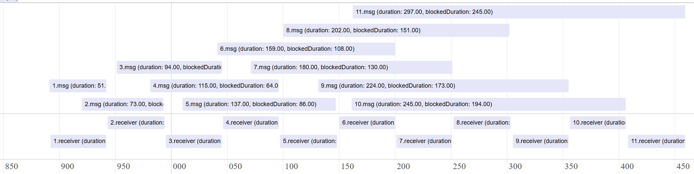

# Explainer: Extending Long Animation Frames to Detect Congested Moments in Documents and Workers

Author: [Joone Hur](https://github.com/joone) (Microsoft), Noam Rosenthal (Google)

<!-- START doctoc generated TOC please keep comment here to allow auto update -->
<!-- DON'T EDIT THIS SECTION, INSTEAD RE-RUN doctoc TO UPDATE -->
**Table of Contents**

- [Introduction](#introduction)
- [Goals](#goals)
- [Non-Goals](#non-goals)
- [Problems](#problems)
  - [1. Long-running tasks blocking the event loop](#1-long-running-tasks-blocking-the-event-loop)
    - [Long-running JavaScript tasks](#long-running-javascript-tasks)
    - [Long-running tasks delaying rendering in a worker (OffscreenCanvas)](#long-running-tasks-delaying-rendering-in-a-worker-offscreencanvas)
  - [2. Task queue buildup from high-frequency work](#2-task-queue-buildup-from-high-frequency-work)
    - [Concurrent task sources causing queue congestion](#concurrent-task-sources-causing-queue-congestion)
    - [Queue buildup from high-frequency postMessage calls](#queue-buildup-from-high-frequency-postmessage-calls)
  - [3. Delays from browser-internal operations](#3-delays-from-browser-internal-operations)
    - [Microtask checkpoint processing](#microtask-checkpoint-processing)
- [Proposed Solution: extending LoAF](#proposed-solution-extending-loaf)
  - [What is Congested Moment?](#what-is-congested-moment)
  - [Why extend LoAF instead of creating a new performance API?](#why-extend-loaf-instead-of-creating-a-new-performance-api)
  - [Long Animation Frame vs. Congested Moment](#long-animation-frame-vs-congested-moment)
  - [How to use the API](#how-to-use-the-api)
  - [Congested Moment Entry Structure](#congested-moment-entry-structure)
  - [The `scriptCount` property](#the-scriptcount-property)
  - [The `cadence` property](#the-cadence-property)
  - [Frame-based cadence in Web Workers (OffscreenCanvas)](#frame-based-cadence-in-web-workers-offscreencanvas)
  - [The `executionContext` property](#the-executioncontext-property)
  - [`PerformanceExecutionContextInfo` Interface](#performanceexecutioncontextinfo-interface)
  - [Example: diagnosing congestion from a flood of small tasks](#example-diagnosing-congestion-from-a-flood-of-small-tasks)
- [Relationship to the MessageEvent Timing API](#relationship-to-the-messageevent-timing-api)
- [Related Discussion, Articles, and Browser Issues](#related-discussion-articles-and-browser-issues)
- [Privacy and Security Considerations](#privacy-and-security-considerations)
- [Acknowledgements](#acknowledgements)
- [References](#references)

<!-- END doctoc generated TOC please keep comment here to allow auto update -->

# Introduction

Modern web applications run across multiple execution contexts, such as documents, iframes, and workers, each of which processes a stream of tasks. Responsiveness depends on these tasks running on time, but in practice a task queue can become *congested* when tasks pile up faster than they can be drained. When this happens, the page feels sluggish and important work is delayed.

Today's web performance APIs cannot reliably surface this problem. The Long Animation Frame (LoAF) and Long Tasks APIs run only on the main thread and are anchored to rendering, reporting a frame only when it is delayed beyond the 50ms threshold. As a result, they miss congestion that builds from many short tasks (a frame can update between those tasks), cannot represent a congested period that spans many frames, and offer no coverage in workers at all.

We address this by defining a **congested moment**: a sustained interval during which the task queue stays congested, reported as a single entry regardless of how many frames it spans. (See [What is Congested Moment?](#what-is-congested-moment) for the precise definition.)

Rather than introduce a separate API, this explainer proposes to **extend the Long Animation Frame API** to report congested moments as an additional cadence, alongside the existing animation-frame cadence, and to make LoAF available in Web Workers. With this extension, developers can detect periods of persistent congestion and pinpoint their sources, on both the main thread and in workers, using a single familiar API and without manual instrumentation.

# Goals

The goal of this proposal is to extend the Long Animation Frame API so that developers can observe sustained task-queue congestion, in both documents and Web Workers, without manual instrumentation. Concretely, we aim to:

* **Report a congested moment as a LoAF entry.** Introduce a *congested moment* as an additional reporting cadence, alongside the existing animation-frame cadence. It is reported as a single entry spanning the whole congested interval, regardless of how many frames are rendered within it.

* **Support Web Workers.** Make LoAF available in Web Worker contexts, using the congested moment as the criterion for generating entries. When a Web Worker drives an OffscreenCanvas, its LoAF should additionally follow the main thread's frame-based (rAF) cadence so that rendering latency remains measurable.

* **Allow a customizable threshold.** Let observers configure `durationThreshold` so reporting sensitivity can be tuned per context, for example, a longer threshold for heavy background processing versus a shorter one for a high-performance game engine.

* **Expose congestion-attribution properties.** Add a `scriptCount` property that counts all JS entry points within the interval, making it easy to distinguish a single long task (low count) from queue congestion (high count). Also expose a `cadence` property (with values such as `"animation-frame"` or `"congested-moment"`) so developers can tell which cadence produced a given entry.

# Non-Goals

- This API is intended for **post-hoc observation** (logging and diagnosing congestion after it occurs), not for providing a real-time back-off or scheduling-control mechanism.
- It is **not a replacement for the Long Tasks API or the existing animation-frame LoAF reporting**; the congested-moment cadence is added alongside them.
- **Per-message attribution is out of scope.** Identifying which individual `postMessage` was delayed, and its serialization/deserialization cost, is covered by the [MessageEvent Timing explainer](../message-event-timing/explainer.md).
- **Cross-origin attribution is out of scope.** Scripts and execution contexts that are not same-origin with the observer are not exposed in detail; see [Privacy and Security Considerations](#privacy-and-security-considerations).


# Problems

Each execution context processes a stream of tasks, including user input, timers, rendering updates, and `postMessage` communication. When a context becomes congested, it can no longer process these tasks, events, or messages in a timely manner. Users then experience delays in rendering or interaction, such as content not updating promptly after user input. In a worker, a `postMessage` may not be handled promptly, so important work such as reading data from IndexedDB is held back.

Congestion may arise from various sources, including long-running tasks, a high rate of incoming tasks, or internal browser operations. Understanding the causes of such congestion, as well as which events are affected, is essential for diagnosing and improving application responsiveness. We can categorize the problems into three types:

**1. Long-running tasks blocking the event loop**

The event loop is occupied by tasks or operations that run for a long duration, preventing runnable work from being processed.

This includes:
* Long-running JavaScript tasks
* Extended microtask execution (e.g., long Promise chains)
* Synchronous APIs that block the main thread

**2. Task queue buildup from high-frequency work**

Runnable tasks are enqueued faster than they can be processed, resulting in a growing queue and delayed execution. This can occur from a single high-frequency source or from multiple independent sources whose combined rate exceeds processing capacity.

This can occur when:

* High-frequency task sources (e.g., input events, timers, network callbacks, or messaging) continuously enqueue work
* Multiple independent sources (e.g., input events and timers, or messages from multiple workers) enqueue work concurrently
* Medium-duration tasks accumulate without sufficient idle gaps

For example, frequent messaging (e.g., repeated `postMessage` calls between windows, frames, or workers) can enqueue `message` events faster than they can be processed, leading to a sustained backlog even when individual handlers are short.

**3. Delays from browser-internal operations**

The execution context is delayed by internal browser operations that run on the event loop but are not always visible as explicit JavaScript tasks.

Examples include:
* Garbage collection pauses
* Style and layout processing
* Rendering-related processing
* Message serialization and deserialization
* Microtask checkpoint processing

The following sections will analyze each area with examples. Some examples involve web workers, but similar situations can also occur between the main window and iframes.

## 1. Long-running tasks blocking the event loop

A long-running task fully occupies the event loop of an execution context, blocking all other runnable work until it completes. This applies to both the main thread and web workers. Even though workers run off the main thread, a long task in a worker still blocks that worker's own event loop.

### Long-running JavaScript tasks

The following example code demonstrates how a long-running task on a worker thread can block subsequent messages in its task queue.

[Link to live demo](https://wicg.github.io/delayed-message-timing/examples/long_task/)

**index.html**

```html
<!DOCTYPE html>
<html lang="en">
<head>
    <meta charset="UTF-8">
    <title>Delayed Messages in Web Workers Caused by Task Overload</title>
</head>
<body>
    <h3>Delayed Messages in Web Workers Caused by Task Overload</h3>
    <button onclick="runWorker()">Start</button>
    <p id="result"></p>
    <script src="main.js"></script>
</body>
</html>
```

**main.js**

When the user clicks the "Start" button, the `runWorker` function dispatches five messages to the worker at 60ms intervals. Each message includes an input number that dictates how long a simulated task should run in the worker.

```javascript
function runWorker() {
  const worker = new Worker("worker.js", { name: "long_task_worker" });
  let i = 0;
  const interval = 60; // Interval in milliseconds
  const inputArray = [50, 50, 50, 120, 50]; // Durations for tasks in worker

  // Function to send messages to the worker at the specified interval
  function sendMessage() {
    if (i < inputArray.length) {
      const input = inputArray[i];
      // Send a message to the worker
      worker.postMessage({
        no: i+1,
        input: input,
        startTime: performance.now() + performance.timeOrigin, // Absolute time
      });
      i++;
    } else {
      // Stop sending messages.
      clearInterval(messageInterval);
    }
  }

  // Start sending messages every 60ms
  const messageInterval = setInterval(sendMessage, interval);
}
```

**worker.js**

The web worker receives messages and simulates a task that runs for the duration specified by `e.data.input`. If this duration is greater than the message sending interval (60ms), it can block subsequent messages.

```javascript
// Simulates a task that consumes CPU for a given duration
function runTask(duration) {
  const start = Date.now();
  while (Date.now() - start < duration) { // Use duration directly
    /* Busy wait to simulate work */
  }
}

onmessage = function runLongTaskOnWorker(e) {
  const processingStart = e.timeStamp; // Time when onmessage handler starts
  const taskStartTime = performance.now();
  
  runTask(e.data.input); // Simulate the work
  
  const taskDuration = performance.now() - taskStartTime;
  // Calculate timings relative to worker's performance.timeOrigin
  const startTime = e.data.startTime - performance.timeOrigin;
  const blockedDuration = processingStart - startTime;
};
```

The following timeline illustrates message handling:


In this timeline, messages \#1, \#2, and \#3 are handled promptly because their simulated tasks (50ms) complete within the 60ms interval at which messages are sent.

However, message \#4's task is instructed to run for 120ms. While it's processing, message \#5 (sent 60ms after message \#4 was sent) arrives at the worker. Message \#5 must wait in the worker's task queue until message \#4 completes. This results in message \#5 experiencing a significant delay (approximately 60ms) before its handler can even begin.

Manually instrumenting code with `performance.now()` and `event.timeStamp` can help identify the root cause of delays as shown. However, in complex real-world applications, precisely identifying which long task caused a specific message delay, or distinguishing between delay caused by a preceding long task versus a message's own long handler, is very challenging without comprehensive, dedicated monitoring.

### Long-running tasks delaying rendering in a worker (OffscreenCanvas)

A long task in a worker does not only delay incoming messages; when the worker drives an `OffscreenCanvas`, it also delays the worker's own rendering. A worker that animates an `OffscreenCanvas` typically renders inside a `requestAnimationFrame` (`rAF`) loop, just like the main thread. Because `rAF` callbacks are dispatched on the worker's event loop, any long task running on that loop pushes the next `rAF` callback later, so frames are produced late and the animation stutters — a rendering latency that is invisible to the main thread's LoAF.

The following example runs a small game in a worker. The main thread transfers an `OffscreenCanvas` to the worker and forwards keyboard input; the worker renders each frame from a `requestAnimationFrame` loop. To simulate variable per-frame work, each frame computes a Fibonacci number of random size, which occasionally produces a long task that delays the next `rAF` callback and therefore the next rendered frame.

[Link to live demo](https://wicg.github.io/delayed-message-timing/examples/game_worker/)

**index.html**

```html
<!doctype html>
<html lang="en">
  <head>
    <meta charset="UTF-8" />
    <meta name="viewport" content="width=device-width, initial-scale=1.0" />
    <title>Game Input with OffscreenCanvas</title>
  </head>
  <body>
    <canvas id="gameCanvas" width="800" height="600"></canvas>
    <script src="game.js"></script>
  </body>
</html>
```

**game.js**

The main thread transfers control of the canvas to the worker with `transferControlToOffscreen()`, then forwards `keydown` and `keyup` events to it. Note that the main thread's LoAF observer only sees long animation frames on the main thread; it cannot observe the worker's rendering frames.

```js
const canvas = document.getElementById("gameCanvas");
const offscreen = canvas.transferControlToOffscreen();
const worker = new Worker("game_worker.js");

worker.postMessage({ canvas: offscreen }, [offscreen]);

// Forward key inputs to the worker
window.addEventListener("keydown", (e) => {
  worker.postMessage({ type: "keydown", key: e.key });
});

window.addEventListener("keyup", (e) => {
  worker.postMessage({ type: "keyup", key: e.key });
});

// The main thread's LoAF observer cannot see the worker's rendering frames.
const observer = new PerformanceObserver((list) => {
  list.getEntries().forEach((entry) => {
    console.log(
      `Long animation frame on the main thread: ${entry.duration.toFixed(2)}ms`,
    );
  });
});

observer.observe({ type: "long-animation-frame", buffered: true });
```

**game_worker.js**

The worker renders each frame inside a `requestAnimationFrame` loop. Before drawing, it computes `fibonacci()` of a random size to simulate variable per-frame work. When that computation is large, it occupies the worker's event loop long enough to delay the next `rAF` callback and the next rendered frame. The worker has no performance API today that can attribute this delay to the script responsible.

```js
function getRandomNumber(min, max) {
  return Math.floor(Math.random() * (max - min + 1)) + min;
}

function fibonacci(n) {
  if (n <= 1) return n;
  return fibonacci(n - 1) + fibonacci(n - 2);
}

self.addEventListener("message", (event) => {
  if (event.data.canvas) {
    setupGame(event.data.canvas);
  } else if (event.data.type === "keydown" || event.data.type === "keyup") {
    handleInput(event.data);
  }
});

let ctx;
let isRunning = true;
const keysPressed = new Set();

const rectangle = { x: 120, y: 100, width: 50, height: 50, speed: 5 };

function setupGame(offscreenCanvas) {
  ctx = offscreenCanvas.getContext("2d");
  startGameLoop();
}

function handleInput(input) {
  if (input.type === "keydown") {
    keysPressed.add(input.key);
  } else if (input.type === "keyup") {
    keysPressed.delete(input.key);
  }
}

function startGameLoop() {
  function gameLoop() {
    // Simulate variable per-frame work; large values become a long task
    // that delays the next rAF callback (and therefore the next frame).
    fibonacci(getRandomNumber(10, 35));

    ctx.clearRect(0, 0, 800, 600);

    // Update position based on key input
    if (keysPressed.has("ArrowUp")) rectangle.y -= rectangle.speed;
    if (keysPressed.has("ArrowDown")) rectangle.y += rectangle.speed;
    if (keysPressed.has("ArrowLeft")) rectangle.x -= rectangle.speed;
    if (keysPressed.has("ArrowRight")) rectangle.x += rectangle.speed;

    // Keep the rectangle within bounds
    rectangle.x = Math.max(0, Math.min(rectangle.x, 800 - rectangle.width));
    rectangle.y = Math.max(0, Math.min(rectangle.y, 600 - rectangle.height));

    ctx.fillStyle = "blue";
    ctx.fillRect(rectangle.x, rectangle.y, rectangle.width, rectangle.height);

    if (isRunning) {
      requestAnimationFrame(gameLoop);
    }
  }

  gameLoop();
}
```

When `fibonacci()` is given a large value, the frame's work blocks the worker's event loop long enough that the next `requestAnimationFrame` callback fires late, so the rectangle visibly stutters even though the main thread stays idle.

To see why this stutter is invisible to existing tooling, it helps to understand how the worker's rendering reaches the screen. The worker's `requestAnimationFrame` is driven by the display's refresh signal (vsync, ~16.7ms at 60Hz), independently of the main thread and without blocking it. Each frame, the worker draws into the `OffscreenCanvas` and commits the result to a frame buffer. The compositor is **decoupled** from the worker: at every vsync it simply composites whatever is currently in that buffer onto the page. It does not wait for, or check whether, the worker's `rAF` callback has finished — it follows a *latest-wins* model and reuses the most recently committed buffer.

This decoupling is what makes the rendering latency hard to observe:

- When a frame's work (here, a large `fibonacci()`) overruns the ~16.7ms budget, the worker commits **no new buffer** in time, so the compositor re-presents the **previous** frame. One or more frames are effectively dropped, and the animation stutters — yet nothing blocks or even notifies the compositor.
- Because the work happens entirely on the worker, the **main thread stays idle**, so the main thread's LoAF reports nothing. The slow frame is simply not visible from where today's frame-anchored reporting runs.
- The same blocked event loop also delays any input `message` handlers already queued in the worker, so rendering latency and input latency build up together — but neither is attributed to the script responsible.

Today, workers have no frame-anchored performance reporting at all: LoAF runs only on the main thread, so no existing API can tell a developer *which* worker frame was late or *which* function caused it. This motivates the goal in [Goals](#goals) that a worker driving an `OffscreenCanvas` should additionally follow the main thread's frame-based (`rAF`) cadence, so that this rendering latency is reported as a LoAF entry — anchored to the late frame and carrying per-script attribution. The precise criterion for generating such an entry is defined in [Frame-based cadence in Web Workers (OffscreenCanvas)](#frame-based-cadence-in-web-workers-offscreencanvas).

## 2. Task queue buildup from high-frequency work

Congestion can also occur when tasks arrive faster than they can be processed, even if no single task is long. On the main thread, this happens when high-frequency sources such as input events, timers, or network callbacks saturate the queue. In web workers, it occurs when a large volume of messages is posted in a short period. In both cases, the accumulated backlog delays subsequent tasks, including time-sensitive ones.

### Concurrent task sources causing queue congestion

In this example, `mousemove` events and a periodic timer callback independently enqueue tasks on the same event loop. Although each task does only a small amount of work, their combined arrival rate can exceed the event loop's processing capacity and cause the timer callback to experience noticeable delay.

[Link to live demo](https://wicg.github.io/delayed-message-timing/congested_moment/concurrent_task_sources/)

```html
<!doctype html>
<html>
  <body>
    <h3>Move your mouse inside the box</h3>
    <div id="area" style="width:300px;height:200px;border:1px solid black;"></div>

    <script>
      // Simulate work
      function busyWork(ms) {
        const start = performance.now();
        while (performance.now() - start < ms) {}
      }

      const NOTICEABLE_DELAY_MS = 50;

      // INPUT EVENT SOURCE
      document.getElementById("area").addEventListener("mousemove", (e) => {
        const schedulingDelay = performance.now() - e.timeStamp; // how late the event was handled
        busyWork(8); // small work per event
        if (schedulingDelay > NOTICEABLE_DELAY_MS)
          console.log(`mousemove scheduling delay: ${schedulingDelay.toFixed(1)} ms`);
      });

      // TIMER SOURCE
      const interval = 100;
      let expectedTime = performance.now() + interval;
      setInterval(() => {
        const now = performance.now();
        const schedulingDelay = now - expectedTime; // how late the timer actually fired
        expectedTime = now + interval;

        busyWork(5); // background periodic work

        if (schedulingDelay > NOTICEABLE_DELAY_MS)
          console.log(`Timer scheduling delay: ${schedulingDelay.toFixed(1)} ms`);
      }, interval);

      console.log("Move your mouse rapidly inside the box...");
    </script>
  </body>
</html>
```

### Queue buildup from high-frequency postMessage calls

This example demonstrates how task queues in web workers can become congested when tasks take longer to process than the rate at which messages are sent. It sends delete tasks every 30ms, then a read task, measuring queue wait times to show the congestion effect.

[Link to live demo](https://wicg.github.io/delayed-message-timing/examples/congested/)

**index.html**

```html
<!doctype html>
<html lang="en">
  <head>
    <meta charset="UTF-8" />
    <meta name="viewport" content="width=device-width, initial-scale=1.0" />
    <title>An example of a task queue experiencing congestion</title>
  </head>
  <body>
    <h1>Task Queue Congestion Example</h1>
    <button onclick="sendTasksToWorker()">Start</button>
    <script src="main.js"></script>
  </body>
</html>
```

**main.js**

In main.js, the email application sends 10 deleteMail tasks every 30 ms to clear junk emails, keeping the worker occupied with intensive processing. Shortly after, the user requests to check their emails, requiring an immediate response.

```js
const worker = new Worker("worker.js");

// Counter for generating unique email IDs for each delete task
let emailID = 0;

function sendTasksToWorker() {
  const interval = setInterval(() => {
    // Send delete task with unique email ID and timestamp
    worker.postMessage({
      emailId: emailID,
      taskName: `deleteMail`,
      startTime: performance.now() + performance.timeOrigin, // Absolute timestamp for timing analysis
    });
    console.log(`[main] dispatching the deleteMail task(email ID: #${emailID})`);
    emailID++;
    if (emailID >= 10) {
      clearInterval(interval);
      // Send final read task - this will experience the most queue delay
      worker.postMessage({
        taskName: "checkMails",
        startTime: performance.now() + performance.timeOrigin, // Timestamp when task is queued
      });
      console.log("[main] dispatching the checkMail task");
    }
  }, 30); // 30ms interval creates congestion (faster than worker's 50ms task duration)
}
```

**worker.js**

The web worker's `onmessage` handler processes `deleteMail` and `checkMails` tasks received from the main thread. Each task requires 50ms to complete.

```js
onmessage = async (event) => {
  const processingStart = event.timeStamp; // Time when worker starts processing this message
  const startTimeFromMain = event.data.startTime - performance.timeOrigin; // Convert to worker timeline
  // Calculate task queue wait time by comparing when the message
  // was sent (from main thread) vs when it started processing (in worker)
  const blockedDuration = processingStart - startTimeFromMain;
  const message = event.data;

  if (message.taskName === "checkMails") {
    await checkMails(message, blockedDuration);
  } else if (message.taskName === "deleteMail") {
    await deleteMail(message, blockedDuration);
  }
};

// Check emails from the mail storage
function checkMails(message, blockedDuration) {
  const startRead = performance.now();
  // Simulate task
  const start = Date.now();
  while (Date.now() - start < 50) {
    /* Do nothing */
  }
  const endRead = performance.now();
  console.log(
    `[worker] ${message.taskName},`,
    `blockedDuration: ${blockedDuration.toFixed(2)} ms,`,
    `duration: ${(endRead - startRead).toFixed(2)} ms`,
  );
}

// Delete an email by ID.
async function deleteMail(message, blockedDuration) {
  return new Promise((resolve) => {
    const startDelete = performance.now();
    // Simulate the delete task.
    const start = Date.now();
    while (Date.now() - start < 50) {
      /* Do nothing */
    }
    const endDelete = performance.now();
    console.log(
      `[worker] ${message.taskName}(email ID: ${message.emailId}),`,
      `blockedDuration: ${blockedDuration.toFixed(2)} ms,`,
      `duration: ${(endDelete - startDelete).toFixed(2)} ms`,
    );
    resolve();
  });
}
```

The following timeline illustrates this congestion:


In this scenario, the worker processes 10 `deleteMail` tasks, each taking 50ms, while being sent every 30ms. This disparity causes tasks to accumulate in the task queue. Consequently, later tasks, like the 11th task `checkMails`, spend a significant amount of time waiting in the queue (e.g., 245ms) even if their own processing time is short (e.g., 51.5ms).

While delays in background tasks like `deleteMail` might be acceptable, delays in user-initiated, high-priority tasks like `checkMails` severely impact user experience. It's important for developers to identify if a browser context or worker is congested and which tasks contribute most to this congestion.

## 3. Delays from browser-internal operations

Some delays originate from browser-internal operations that are not directly visible as JavaScript tasks. The following example demonstrates how microtask processing can contribute to congestion. Serialization and deserialization overhead is another such source; it is covered in detail in the [MessageEvent Timing explainer](../message-event-timing/explainer.md).

### Microtask checkpoint processing

Microtask checkpoint processing executes all pending microtasks (such as Promise reactions) to completion before returning to the task queue. A large or continuously growing microtask queue can delay the dispatch of runnable tasks, leading to sustained congestion even when individual microtasks are short.

Although Promise chains are initiated by JavaScript code, the delay they cause is not obvious from the code alone. The mechanism is an internal browser behavior: the browser drains the entire microtask queue before processing the next task. As a result, a `message` event or other pending task can be delayed significantly without any indication in the JavaScript code that this is happening.

The following example demonstrates how chained Promise reactions can delay a `message` event. When the button is clicked, a `postMessage()` call enqueues a `message` event, but a recursive Promise chain that runs for 1000ms keeps the microtask queue occupied — preventing the `message` event from being dispatched until all microtasks complete.

[Link to live demo](https://wicg.github.io/delayed-message-timing/congested_moment/microtask_checkpoint)

```html
<!doctype html>
<html>
  <body>
    <button id="start">Start</button>

    <script>
      window.addEventListener("message", (event) => {
        console.log("MessageEvent task ran:", event.data);
      });

      document.getElementById("start").addEventListener("click", () => {
        console.log("Click handler started");

        // Enqueue a MessageEvent task.
        console.log("Posting a message to enqueue a MessageEvent task...");
        window.postMessage("ping");

        // Keep enqueuing microtasks via chained Promises for 1000ms.
        const deadline = performance.now() + 1000;
        let count = 0;
        function chainPromise() {
          count++;
          if (performance.now() < deadline) {
            return Promise.resolve().then(chainPromise);
          }
          console.log(`Chained Promise microtasks completed: ${count}`);
        }
        chainPromise();

        console.log("Click handler finished");
      });
    </script>
  </body>
</html>
```

# Proposed Solution: extending LoAF

The problems above share a common root cause: an execution context's task queue becomes a bottleneck, so runnable work is delayed regardless of whether the cause is a single long task or a flood of tiny ones. This section defines the **congested moment** that captures such a period, explains why we report it by extending the Long Animation Frame (LoAF) API rather than introducing a new one, and describes how the extension works.

## What is Congested Moment?

A **congested moment** is a time interval during which an execution context, such as the main thread or a web worker, is persistently overloaded and unable to process events in a timely manner.

More precisely, a congested moment is a continuous time interval where:

1. At least one _runnable_ task is pending (spent more than 200ms in the message queue)
   (e.g. MessageEvent, UIEvent, StorageEvent, FetchEvent).
2. The event loop is saturated so that pending tasks cannot be dispatched — whether by one or more long-running tasks, a high volume of small tasks, or browser-internal operations (e.g., long microtask checkpoints).
3. The interval ends when **no runnable tasks remain pending**.

## Why extend LoAF instead of creating a new performance API?

Detecting a long animation frame and detecting a congested moment are fundamentally the same task: both observe a bottleneck in the message queue and help developers find its cause, whether that is a single long task or a large number of tiny tasks. They differ only in the symptom each surfaces — a delayed rendering frame versus a sustained backlog of delayed tasks (see [Long Animation Frame vs. Congested Moment](#long-animation-frame-vs-congested-moment) for a side-by-side comparison).

Because LoAF is frame-anchored, it cannot capture the second symptom. Consider a burst of short tasks of just 2–3ms each that floods the task queue: a frame can update between those tasks and no single frame crosses 50ms, so LoAF never fires even though tasks are continuously delayed and the queue keeps growing. A single LoAF entry also maps to one frame, so it cannot represent a congested period that spans many frames.

Since the two concepts diagnose the same class of problem, we extend LoAF rather than add a separate API: a congested moment is reported as an additional reporting cadence, alongside the existing animation-frame cadence. This lets developers use a single, familiar API to observe both symptoms, and it brings LoAF coverage to Web Workers, which have none today.

## Long Animation Frame vs. Congested Moment

| | Long Animation Frame | Congested Moment |
| --- | --- | --- |
| **What it reports** | A frame whose work exceeds the threshold | A sustained period in which the task queue stays congested |
| **Trigger threshold** | Frame update delayed > 50ms | A runnable task delayed beyond the threshold (e.g., 200ms) |
| **Typical cause** | A long task delaying the frame's rendering update | A long task *or* many small tasks flooding the queue |
| **Reporting unit** | One entry per frame | One entry spanning the whole congested interval (may cover many frames) |
| **Anchored to rendering** | Yes | No |
| **Available contexts** | Documents, plus Web Workers that drive an OffscreenCanvas (rendering frames) | Documents and Web Workers |
| **`cadence` value** | `"animation-frame"` | `"congested-moment"` |

## How to use the API

```js
const observer = new PerformanceObserver((list) => {
  console.log(list.getEntries());
});

observer.observe({ type: 'long-animation-frame', buffered: true });
```

## Congested Moment Entry Structure

```js
const someCongestedMomentEntry = {
  entryType: "long-animation-frame",
  cadence: "congested-moment", // "animation-frame" | "congested-moment" — which cadence triggered this entry
  startTime,   // When congestion began
  duration,    // Total duration of the congested moment (endTime = startTime + duration)

  // --- Congestion summary ---
  scriptCount,   // Tasks that were JS entry-points
  scripts: [
    {
      name,          // "script"
      entryType,     // "script"
      startTime,     // When script execution began
      duration,      // Elapsed time through microtask queue completion

      // Invocation
      invokerType,   // "classic-script" | "module-script" | "event-listener" | "user-callback" | "resolve-promise" | "reject-promise"
      invoker,       // Descriptive identifier of what triggered execution (e.g. "Worker.onmessage")
      executionStart, // When actual execution began (after compilation, if any)

      // Source attribution
      sourceURL,           // e.g. "https://example.com/worker.js"
      sourceFunctionName,  // e.g. "runTask"
      sourceCharPosition,  // Character offset within the source file

      // Blocking costs
      pauseDuration,                 // Time in synchronous blocking ops (alert, sync XHR, etc.)
      forcedStyleAndLayoutDuration,  // Time in forced style/layout (main thread only)

      // Window attribution (main thread only; null in worker contexts)
      window,             // Reference to originating same-origin window, or null
      windowAttribution,  // "self" | "descendant" | "ancestor" | "same-page" | "other"

      // Details about the execution environment of the script.
      executionContext,   // PerformanceExecutionContextInfo describing where the script ran
    }
  ],
}
```

## The `scriptCount` property

`scriptCount` reports the number of JavaScript entry points (tasks that ran a script) within the congested moment. It is the key signal for distinguishing *what kind* of congestion occurred:

- A **low** `scriptCount` with a long total `duration` indicates that a single long task blocked the event loop.
- A **high** `scriptCount` indicates that the interval was congested by many short tasks piling up faster than they could drain — the case that classic LoAF and Long Tasks cannot surface.

`scriptCount` counts *every* JS entry point in the interval, whereas the `scripts` array lists only those whose individual duration exceeds the per-script reporting threshold. When congestion is caused by a flood of tiny tasks (each only a few milliseconds, none over the threshold), `scripts` can be **empty** even though `scriptCount` is large — the signature of tiny-task congestion, shown concretely in [Example: diagnosing congestion from a flood of small tasks](#example-diagnosing-congestion-from-a-flood-of-small-tasks).

## The `cadence` property

With this proposal, a `long-animation-frame` entry can be produced by two different triggers:

- **`"animation-frame"`** — the existing behavior: an animation frame whose total work exceeds the 50ms threshold.
- **`"congested-moment"`** — the new behavior: a sustained congested moment (a task delayed beyond the threshold until the queue drains), reported regardless of frames and also available in Web Workers.

Because these two cadences can overlap and have different meanings, an entry alone would be ambiguous about why it was reported. We therefore propose a `cadence` property on the entry whose value identifies the trigger:

```js
observer.observe({ type: "long-animation-frame", buffered: true });

function onEntries(list) {
  for (const entry of list.getEntries()) {
    if (entry.cadence === "congested-moment") {
      // Sustained queue congestion: inspect scriptCount and per-script blocking costs.
    } else {
      // Classic long animation frame: inspect rendering-related timings.
    }
  }
}
```

This lets developers branch on the reporting reason without inferring it from other fields, and keeps the existing animation-frame semantics unchanged for code that ignores the new value.

## Frame-based cadence in Web Workers (OffscreenCanvas)

A worker that drives an `OffscreenCanvas` produces rendering frames of its own, so it follows the **animation-frame cadence** in addition to the congested-moment cadence. This section defines when such a worker emits an `animation-frame` LoAF entry.

The criterion mirrors the main thread's existing LoAF rule: an entry is generated when a frame's **span from its scheduled start (the vsync at which the `rAF` callback should have run) to its completion (when the worker commits the frame's buffer) exceeds 50ms** — the same threshold the main thread already uses, roughly three 16.7ms frames at 60Hz. The threshold remains configurable through `durationThreshold`.

The default 50ms is appropriate for general responsiveness, but a worker rendering a real-time animation such as a game is far more latency-sensitive: at 60Hz it must produce a fresh frame every ~16.7ms, so even a single missed frame is a visible stutter. Such contexts should lower `durationThreshold` toward one frame (for example, ~20ms, just over the 16.7ms budget) so that a single late frame is reported rather than only sustained stalls of three or more frames. This is the per-context tuning called out in [Goals](#goals): a longer threshold for heavy background processing versus a shorter one for a high-performance game engine.

Two distinct delays can push a frame past this threshold, and both are captured by the single start-to-finish span:

- **The frame cannot start on time.** A preceding long task — or a backlog of queued input `message` handlers — keeps the worker's event loop busy past the next vsync, so the `rAF` callback is dispatched late. The waiting time before the callback runs is counted in the frame's span.
- **The frame cannot finish on time.** The `rAF` callback's own work (for example, a large `fibonacci()`) runs past the frame budget before it can commit a new buffer. The callback's execution time is counted in the frame's span.

Because both cases are measured as one start-to-finish interval, a worker frame is reported exactly when that interval crosses the threshold, regardless of which delay dominated. The resulting entry carries `cadence: "animation-frame"`, and its `scripts` array attributes the blocking work to the responsible function.

This is distinct from the congested-moment cadence: a **single late frame** is reported as an `animation-frame` entry, whereas **sustained queue congestion that spans many frames** is reported as a `congested-moment` entry. A worker driving an `OffscreenCanvas` can emit both.

With this extension, the `game_worker.js` example above can monitor its own rendering frames directly from inside the worker — something no API allows today. The worker registers a `PerformanceObserver` for `long-animation-frame` entries and inspects the late ones:

```js
// Inside game_worker.js — observe the worker's own rendering frames.
const observer = new PerformanceObserver((list) => {
  for (const entry of list.getEntries()) {
    if (entry.cadence !== "animation-frame") continue; // ignore congested-moment entries here

    console.log(
      `Late worker frame: ${entry.duration.toFixed(1)}ms ` +
      `(started at ${entry.startTime.toFixed(1)})`,
    );

    // Attribute the delay to the function responsible (e.g. fibonacci()).
    for (const script of entry.scripts) {
      console.log(
        `  blocked by ${script.sourceFunctionName} ` +
        `in ${script.sourceURL} for ${script.duration.toFixed(1)}ms`,
      );
    }
  }
});

// durationThreshold tunes how late a frame must be before it is reported.
// A game targets 60Hz (~16.7ms/frame), so use a short threshold (~20ms,
// just over one frame) to catch even a single missed frame.
observer.observe({ type: "long-animation-frame", durationThreshold: 20, buffered: true });
```

When a large `fibonacci()` pushes a frame past the threshold, this observer fires with an `animation-frame` entry whose `scripts` array points at `fibonacci` in `game_worker.js`, so the developer learns both *which* frame was late and *why* — without any manual `performance.now()` instrumentation.

## The `executionContext` property

Because this proposal extends LoAF to Web Workers, a single observer can receive entries whose blocking scripts ran in different execution contexts (for example, the main thread and one or more dedicated workers). The existing `window` and `windowAttribution` properties only describe same-origin windows and are `null` in worker contexts, so they cannot identify which worker a script belongs to.

To close this gap, we extend each `PerformanceScriptTiming` entry in the `scripts` array with an `executionContext` property. It returns a `PerformanceExecutionContextInfo` instance describing the execution environment, document or worker, in which the script ran, allowing developers to attribute each blocking script to the specific context that produced it.

```js
for (const entry of list.getEntries()) {
  for (const script of entry.scripts) {
    const ctx = script.executionContext;
    console.log(`script ran in ${ctx.type} (id=${ctx.id}, name="${ctx.name}")`);
  }
}
```

## `PerformanceExecutionContextInfo` Interface

The `executionContext` property returns a `PerformanceExecutionContextInfo` instance, which identifies the execution context in which the script ran via its `id`, `name`, and `type` (e.g. `"main-thread"`, `"dedicated-worker"`, `"window"`, or `"iframe"`).

This interface is shared with the [MessageEvent Timing explainer](../message-event-timing/explainer.md#performancemessagescriptinfo-and-performanceexecutioncontextinfo), where it is defined in full. The same definition applies here so that execution-context attribution is consistent across both proposals.

## Example: diagnosing congestion from a flood of small tasks

Consider a worker whose queue is flooded with many small `message` handlers (each only ~2–3ms), posted faster than they can drain — the pattern from [Task queue buildup from high-frequency work](#2-task-queue-buildup-from-high-frequency-work). No single handler is long enough to register as a long task or to push an animation frame past 50ms, so classic APIs stay silent. A single congested-moment entry, however, captures the whole period:

```js
{
  entryType: "long-animation-frame",
  cadence: "congested-moment",
  startTime: 1820.0,  // when the queue first stayed congested past the threshold
  duration: 214.0,    // just over the 200ms threshold, until the queue fully drained

  scriptCount: 118,   // ~118 JS entry points ran in the interval — almost all 2–3ms message handlers
  scripts: [
    // Only scripts that individually exceeded the per-script reporting threshold appear here;
    // the ~2–3ms handlers are counted in scriptCount but not listed.
    { invoker: "Worker.onmessage", sourceURL: "https://example.com/worker.js",
      sourceFunctionName: "handleMessage", duration: 7.8,
      executionContext: { id: 1, type: "dedicated-worker", name: "" } },
    { invoker: "Worker.onmessage", sourceURL: "https://example.com/worker.js",
      sourceFunctionName: "handleMessage", duration: 6.1,
      executionContext: { id: 1, type: "dedicated-worker", name: "" } },
  ],
}
```

The diagnosis comes from the *shape* of the entry: a high `scriptCount` (118) over a `duration` only slightly above the threshold, with a nearly empty `scripts` array, means no individual task was expensive — the context was saturated by sheer task volume. This is exactly the tiny-task congestion that the Long Tasks and Long Animation Frame APIs cannot surface, and it is now visible in both documents and workers.


# Relationship to the MessageEvent Timing API

This proposal is complementary to the [MessageEvent Timing explainer](../message-event-timing/explainer.md). The two operate at different granularities:

* **This proposal (Congested Moment / LoAF extension)** provides *interval-level* attribution: it surfaces a sustained period during which an execution context is overloaded, along with the blocking scripts responsible. It is reported via the `"long-animation-frame"` entry type.
* **`PerformanceMessageEventTiming`** provides *per-message* timing and attribution: when a specific `postMessage` was sent, how long it waited in the queue, its serialization/deserialization cost, and which script and execution context sent and handled it. It is reported via the `"event"` entry type.

When an execution context is congested, it typically delays many messages at once. This proposal explains *why the context was congested as a whole*, while `PerformanceMessageEventTiming` explains *what happened to an individual message*. Both share the `PerformanceExecutionContextInfo` interface for identifying execution contexts, keeping attribution consistent across the two.

# Related Discussion, Articles, and Browser Issues

- **Chromium Issue:** [Support Long Tasks API in workers](https://issues.chromium.org/issues/41399667)
  Web developers are interested in extending the Long Tasks API to monitor delayed execution in web workers. Unlike the Long Animation Frames (LoAF) API, the current Long Tasks API lacks script attribution, making it harder to trace the source of delays.

# Privacy and Security Considerations

This proposal exposes timing and attribution data that could, if unconstrained, reveal cross-origin information. The following constraints apply:

- **Same-origin attribution only.** Per-script details such as `sourceURL`, `sourceFunctionName`, and `sourceCharPosition` are exposed only for scripts that are same-origin with the observing context. Cross-origin scripts are reported without these identifying fields, consistent with the existing Long Animation Frame API.
- **No new cross-origin timing channel.** The congested-moment interval and `scriptCount` aggregate work on the observer's own event loop; they do not expose the internal timing of cross-origin frames or workers beyond what LoAF already permits.
- **Worker contexts.** Extending reporting to Web Workers follows the same same-origin restrictions; a worker entry only attributes scripts running in contexts the observer is entitled to see.
- **Timestamp coarsening.** As with other high-resolution timing APIs, timestamps are subject to the platform's existing resolution-clamping protections against timing attacks.

# Acknowledgements

Thank you to Michal Mocny for valuable feedback and advice.

# References
- [Event Timing API](https://w3c.github.io/event-timing/)
- [Extending Long Tasks API to Web Workers](https://github.com/MicrosoftEdge/MSEdgeExplainers/blob/main/LongTasks/explainer.md)
- https://developer.mozilla.org/en-US/docs/Web/API/PerformanceLongTaskTiming
- https://developer.mozilla.org/en-US/docs/Web/API/PerformanceScriptTiming
- https://developer.mozilla.org/en-US/docs/Web/API/MessageEvent
- https://developer.chrome.com/docs/web-platform/long-animation-frames
