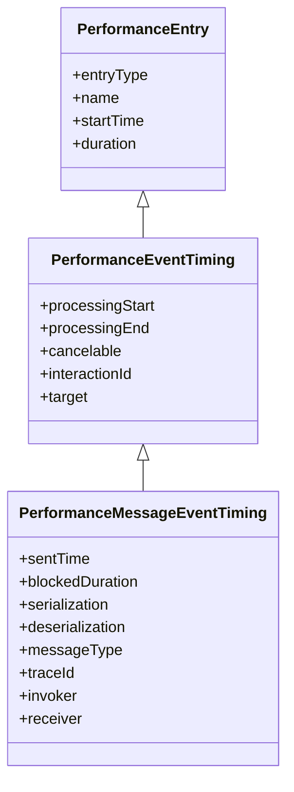

# Explainer: Exposing MessageEvent Timing via the Event Timing API

Author: [Joone Hur](https://github.com/joone) (Microsoft), Michal Mocny (Google) 

# Introduction

Web applications frequently use the `postMessage` API for communication across different execution contexts, such as between windows, iframes, and web workers. However, message delays often occur when messages are queued but not processed promptly, degrading responsiveness. Today, it is hard to identify delayed `postMessage` events without manual instrumentation.

This explainer proposes exposing end-to-end timing for `postMessage` as part of the [Event Timing API](https://developer.mozilla.org/en-US/docs/Web/API/PerformanceEventTiming). Because most `postMessage` events are ultimately triggered by user interaction, modeling `MessageEvent` as an Event Timing entry is a natural fit and reuses existing, familiar machinery.

This will enable developers to identify delayed `postMessage` communication across windows, iframes, and web workers. By exposing end-to-end timing and attribution data, including task queue wait time, serialization/deserialization cost, and blocking tasks, it helps identify bottlenecks that degrade responsiveness in complex web applications.

# Goals


# Non-Goals


# Problems

When a `postMessage` event is delayed, developers can detect *that* a delay happened, but pinpointing *why* is difficult with current tools. A delay can stem from the receiver's thread being busy with a long task, from task queue congestion, or from serialization/deserialization overhead. The information needed to distinguish these causes is either impossible or impractical to obtain from JavaScript.

## 1. Queue wait time (`blockedDuration`) is hard to measure accurately

The most useful signal for diagnosing a delayed message is how long it waited in the receiver's task queue *before* its handler ran. Approximating this with manual instrumentation requires comparing a sender-side timestamp (passed in the message payload) against a receiver-side timestamp taken at the start of `onmessage`. This is error-prone because the two contexts have different `timeOrigin`s, and the measured value mixes together serialization, actual queue wait, and deserialization, so it cannot isolate the pure queueing delay. The browser, however, knows exactly when the message was enqueued and when its handler began.

## 2. Serialization and deserialization costs are not observable

When data is passed to `postMessage()`, it is serialized on the sender side and deserialized on the receiver side. For large or complex payloads these steps can block their respective threads for a significant time. From JavaScript, serialization time can only be roughly approximated by timing the `postMessage()` call (which also includes other overhead), and deserialization timing is even less reliable—browsers may defer it until the data is first accessed, so the measured value varies across implementations. These internal operations are invisible to developers, yet they are often the real source of the delay.

## 3. The sending and receiving contexts are not attributed

Even when a delay is detected, developers cannot easily tell *which* script sent the message and *which* execution context handled it. In complex applications with multiple windows, iframes, and workers, identifying the exact source and destination of a delayed message—including the source location and the type of context (window, iframe, or worker)—is essential for diagnosis but cannot be derived from the `message` event alone.

# Proposed Solution: PerformanceMessageEventTiming

To expose the end-to-end timing of `postMessage` events, we propose **`PerformanceMessageEventTiming`**, a new interface that extends the [Event Timing API](https://developer.mozilla.org/en-US/docs/Web/API/PerformanceEventTiming).

This interface provides the precise queue wait time, the serialization and deserialization durations measured by the browser, and attribution data identifying the sending and receiving scripts and their execution contexts.

This new interface relies on two supporting interfaces:

  * `PerformanceMessageScriptInfo`: Provides details about the script that sent or received the message.
  * `PerformanceExecutionContextInfo`: Describes the execution context (e.g., main thread, worker) of the sender or receiver.

## Message Event Entry Structure




```js
const someMessageEventEntry = {
  entryType: "event",
  name: "message",

  // Timing
  startTime,       // When postMessage() was called on the sender side
  duration,        // startTime → processingEnd
  sentTime,        // When the message was enqueued in the receiver's task queue
  processingStart, // When the onmessage handler began executing
  processingEnd,   // When the onmessage handler completed

  // Attribution
  blockedDuration,  // sentTime → processingStart (pure queue wait time)
  serialization,    // Time spent serializing the message on the sender side
  deserialization,  // Time spent deserializing the message on the receiver side

  // Inherited from PerformanceEventTiming (always false/0 for message events)
  cancelable,    // Always false — message events are not cancelable
  interactionId, // Always 0 — message events have no associated user interaction

  // Message metadata
  messageType, // "cross-worker-document" | "channel" | "cross-document" | "broadcast-channel"
  traceId,     // Unique identifier to correlate sender and receiver entries

  // Script attribution (PerformanceMessageScriptInfo)
  invoker,  // Details about the script that called postMessage()
  receiver  // Details about the script handling the message
}
```

## `PerformanceMessageScriptInfo` and `PerformanceExecutionContextInfo`

`PerformanceMessageScriptInfo` provides attribution details for the script responsible for sending (`invoker`) or handling (`receiver`) a `message` event, including the source URL, function name, and position within the source file. Its `executionContext` property is a `PerformanceExecutionContextInfo` instance that identifies the type of execution context (window, iframe, or worker) where that script is running. Together, these interfaces allow developers to pinpoint exactly which script and context is responsible for a delayed message event.

```js
const somePerformanceMessageScriptInfo = {
  name,                 // "invoker" or "receiver"
  sourceURL,            // URL of the script that sent or handled the message
  sourceFunctionName,   // Function name at the call site; empty string if unavailable
  sourceCharPosition,   // Character offset within the source file
  sourceLineNumber,     // Line number within the source file
  sourceColumnNumber,   // Column number within the source file

  executionContext: {
    id,    // Unique integer ID for this context within the agent cluster (e.g. 0 = main thread)
    name,  // Worker name from new Worker("...", { name }), or window.name; may be empty
    type   // "main-thread" | "dedicated-worker" | "shared-worker" | "service-worker" | "window" | "iframe"
  }
}
```

## Observing `PerformanceMessageEventTiming` Entries

`PerformanceMessageEventTiming` entries can be observed independently of any congested moment. This is useful when a developer wants to monitor delayed messages across all contexts, with attribution details about which script sent the message and which handled it, including source location. This helps identify what kinds of messages are being delayed and where they originate.

Because `PerformanceMessageEventTiming` extends `PerformanceEventTiming`, it is reported via the existing `"event"` entry type and is available in workers as well as the main thread.

The `durationThreshold` option controls the minimum total duration a message event must exceed to be reported. For message events, the minimum enforced threshold is **200ms**; even if a lower value is specified, entries with a duration below 200ms will not be reported. This avoids excessive noise from short-lived messages that do not represent a real responsiveness problem.

```js
const observer = new PerformanceObserver((list) => {
  for (const entry of list.getEntries()) {
    if (entry.name === "message") {
      console.log("Delayed message:", entry);
    }
  }
});

// durationThreshold below 200ms is silently clamped to 200ms for message events
observer.observe({ type: 'event', buffered: true, durationThreshold: 200 });
```


# References
- [Event Timing API](https://w3c.github.io/event-timing/)
- [Extending Long Tasks API to Web Workers](https://github.com/MicrosoftEdge/MSEdgeExplainers/blob/main/LongTasks/explainer.md)
- https://developer.mozilla.org/en-US/docs/Web/API/PerformanceLongTaskTiming
- https://developer.mozilla.org/en-US/docs/Web/API/PerformanceScriptTiming
- https://developer.mozilla.org/en-US/docs/Web/API/MessageEvent
- https://developer.chrome.com/docs/web-platform/long-animation-frames
