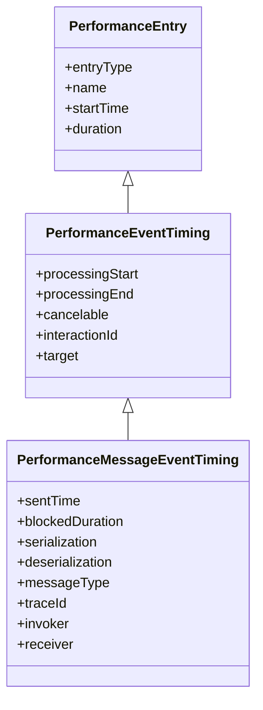

# Explainer: Exposing MessageEvent Timing via the Event Timing API

Author: [Joone Hur](https://github.com/joone) (Microsoft), Michal Mocny (Google) 

# Introduction

Web applications frequently use the `postMessage` API for communication across different execution contexts, such as between windows, iframes, and web workers. However, message delays often occur when messages are queued but not processed promptly, degrading responsiveness. Today, it is hard to identify delayed `postMessage` events without manual instrumentation.

This explainer proposes exposing end-to-end timing for `postMessage` as part of the [Event Timing API](https://developer.mozilla.org/en-US/docs/Web/API/PerformanceEventTiming). Because most `postMessage` events are ultimately triggered by user interaction, modeling `MessageEvent` as an Event Timing entry is a natural fit and reuses existing, familiar machinery.

This will enable developers to identify delayed `postMessage` communication across windows, iframes, and web workers. By exposing end-to-end timing and attribution data, including task queue wait time, serialization/deserialization cost, and blocking tasks, it helps identify bottlenecks that degrade responsiveness in complex web applications.

# Goals

* **Provide detailed end-to-end timing:** Offer comprehensive timing information for `postMessage` events, including task queue wait time, and the time taken for serialization and deserialization, to help pinpoint bottlenecks.

* **Enable detection of congested contexts:** Allow developers to identify specific browser contexts (windows, tabs, iframes) or web workers that are slow to process `MessageEvent`s. This covers [cross-document messaging](https://developer.mozilla.org/en-US/docs/Web/API/Window/postMessage), [cross-worker/document messaging](https://developer.mozilla.org/en-US/docs/Web/API/Worker/postMessage), [channel messaging](https://developer.mozilla.org/en-US/docs/Web/API/Channel_Messaging_API), and [broadcast channels](https://developer.mozilla.org/en-US/docs/Web/API/Broadcast_Channel_API).

* **Identify the origin of a `MessageEvent`:** Allow developers to identify which execution context sent a `MessageEvent`.

# Non-Goals

* **Interval-level congestion is out of scope.** This proposal reports timing for individual `message` events, not the sustained congestion intervals that may delay them. Diagnosing a congested execution context as a whole is covered by the [Congested Moment / LoAF extension explainer](../loaf-congested-moments/explainer.md).
* **Non-`postMessage` communication is out of scope.** This API does not provide diagnostics for:
  * [Server-sent events](https://developer.mozilla.org/en-US/docs/Web/API/Server-sent_events)
  * [WebSockets](https://developer.mozilla.org/en-US/docs/Web/API/WebSockets_API)
  * [WebRTC data channels](https://developer.mozilla.org/en-US/docs/Web/API/RTCDataChannel)

# Problems

When a `postMessage` event is delayed, developers can detect *that* a delay happened, but pinpointing *why* is difficult with current tools. A delay can stem from the receiver's thread being busy with a long task, from task queue congestion, or from serialization/deserialization overhead. The information needed to distinguish these causes is either impossible or impractical to obtain from JavaScript.

## 1. Queue wait time (`blockedDuration`) is hard to measure accurately

The most useful signal for diagnosing a delayed message is how long it waited in the receiver's task queue *before* its handler ran. Approximating this with manual instrumentation requires comparing a sender-side timestamp (passed in the message payload) against a receiver-side timestamp taken at the start of `onmessage`. This is error-prone because the two contexts have different `timeOrigin`s, and the measured value mixes together serialization, actual queue wait, and deserialization, so it cannot isolate the pure queueing delay. The browser, however, knows exactly when the message was enqueued and when its handler began.

## 2. Serialization and deserialization costs are not observable

When data is passed to `postMessage()`, it is serialized on the sender side and deserialized on the receiver side. For large or complex payloads these steps can block their respective threads for a significant time. From JavaScript, serialization time can only be roughly approximated by timing the `postMessage()` call (which also includes other overhead), and deserialization timing is even less reliable—browsers may defer it until the data is first accessed, so the measured value varies across implementations. These internal operations are invisible to developers, yet they are often the real source of the delay.

The following example code demonstrates the delay introduced by serializing/deserializing a large JSON object during `postMessage()`.

[Link to live demo](https://wicg.github.io/delayed-message-timing/examples/serialization/)

**index.html**

```html
<!doctype html>
<html lang="en">
  <head>
    <meta charset="UTF-8" />
    <title>postMessage Serialization/Deserialization Performance Impact</title>
  </head>
  <body>
    <button id="sendJSON">Send Large JSON (~7MB)</button>
    <script src="main.js"></script>
  </body>
</html>
```

**main.js**

In the main.js file, 7000 JSON objects are sent to the worker using `postMessage()`. The duration of serialization can be measured by calling `performance.now()` before and after executing `postMessage()`.

```js
const worker = new Worker("worker.js");

// Generate a large JSON object to demonstrate serialization overhead
function generateLargeJSON(size) {
  const largeArray = [];
  for (let i = 0; i < size; i++) {
    largeArray.push({ 
      id: i, 
      name: `Item ${i}`, 
      data: Array(1000).fill("x") // Each item contains ~1KB of string data
    });
  }
  return { items: largeArray }; // Returns ~7MB object when size=7000
}

// Send a large JSON object to the worker to demonstrate serialization overhead
function sendLargeJSON() {
  const largeJSON = generateLargeJSON(7000); // ~7MB of data
  console.log("[main] Dispatching a large JSON object to the worker.");

  // Measure time for postMessage call (includes serialization)
  const startTime = performance.now();
  worker.postMessage({
    receivedData: largeJSON,
    startTime: startTime + performance.timeOrigin,
  });
  const endTime = performance.now();
  
  // Note: This timing includes serialization but may also include other overhead
  console.log(
    `[main] postMessage call duration (includes serialization): ${(endTime - startTime).toFixed(2)} ms`,
  );
}

// Add event listener to the button
document.getElementById("sendJSON").addEventListener("click", sendLargeJSON);
```

**worker.js**

In worker.js, the duration of deserialization is estimated by calling `performance.now()` immediately before and after the first access to properties of event.data (e.g., `event.data.startTime`), as this access typically triggers the deserialization process.

```js
// Worker receives large data
onmessage = (event) => {
  const processingStart = event.timeStamp;
  // Measure deserialization time by accessing the large data object
  // Note: Deserialization typically occurs when data is first accessed (implementation-dependent)
  const deserializationStartTime = performance.now();
  const startTimeFromMain = event.data.startTime - performance.timeOrigin;
  const receivedData = event.data.receivedData;
  const deserializationEndTime = performance.now();
  const blockedDuration = processingStart - startTimeFromMain;

  console.log("[worker] Deserialized Data:", receivedData.items.length, "items.");
  console.log(
    "[worker] Deserialization time:",
    (deserializationEndTime - deserializationStartTime).toFixed(2),
    "ms",
  );

  const totalDataProcessingTime = (deserializationEndTime - startTimeFromMain); 
  console.log("[worker] blockedDuration (including serialization):", blockedDuration.toFixed(2), "ms");
  console.log("[worker] serialization + deserialization (estimate):", totalDataProcessingTime.toFixed(2), "ms");
};
```

**Console logs**
```
[main] Dispatching a large JSON object to the worker.
[main] postMessage call duration (~7MB object serialization): 111.20 ms
[worker] Deserialized Data: 7000 items.
[worker] Deserialization time: 454.40 ms
[worker] blockedDuration (including serialization): 111.10 ms
[worker] serialization + deserialization (estimate): 566.00 ms
```
As shown, serialization on the main thread (approx. 111.20 ms) occurs synchronously during the `postMessage()` call, blocking other main thread work. Similarly, deserialization on the worker thread (approx. 454.40 ms) is a significant operation that blocks the worker's event loop during message processing, delaying the execution of the `onmessage` handler and any subsequent tasks.

In this example, the worker log `blockedDuration: 111.10 ms` indicates the time elapsed from when the main thread initiated the `postMessage()` (including its 111.20 ms serialization block) to when the worker's `onmessage` handler began execution. This suggests that the task queue wait time is nearly zero, and the delay is primarily caused by serialization on the sender side. However, the cost of data handling is difficult to estimate because the size of the message payload can vary depending on the scenario.


## 3. The sending and receiving contexts are not attributed

Even when a delay is detected, developers cannot easily tell *which* script sent the message and *which* execution context handled it. In complex applications with multiple windows, iframes, and workers, identifying the exact source and destination of a delayed message—including the source location and the type of context (window, iframe, or worker)—is essential for diagnosis but cannot be derived from the `message` event alone.

For example, consider a worker that receives requests over a `MessageChannel` from two different execution contexts—the top-level document and an embedded iframe—through separate ports.

**main.js** (top-level document) — hands one port to the worker and keeps the other to send requests:

```js
const worker = new Worker("worker.js");

// Connect the top-level document to the worker via a channel.
const mainChannel = new MessageChannel();
worker.postMessage({ type: "connect" }, [mainChannel.port2]);
mainChannel.port1.postMessage({ query: "loadDashboard" });

// The iframe sets up its own channel to the same worker (see iframe.js).
```

**iframe.js** (embedded iframe) — connects to the same worker through its own channel:

```js
// The iframe also needs a port to the worker, forwarded via the parent.
addEventListener("message", (event) => {
  if (event.data?.type === "workerPort") {
    const port = event.ports[0];
    port.postMessage({ query: "loadWidget" });
  }
});
```

**worker.js** — receives requests from both contexts but cannot tell them apart:

```js
onmessage = (event) => {
  const port = event.ports[0];
  port.onmessage = (e) => {
    // A request arrived — but who sent it, the top-level document or the iframe?
    // For MessagePort messages, e.source is null and e.origin is "", so the
    // worker has no way to attribute the message to its originating context.
    console.log("[worker] request:", e.data.query, "from:", e.source, e.origin);
    handleRequest(e.data);
  };
};
```

**Console output:**

```
[worker] request: loadDashboard from: null
[worker] request: loadWidget from: null
```

Both requests look identical at the receiver: `event.source` is `null` and `event.origin` is an empty string for `MessagePort` messages. Even for `window.postMessage`, `event.source`/`event.origin` only identify the sending *window*, not which script or execution context (and never a worker). As a result, the worker cannot determine whether a delayed request came from the main thread or the iframe, making it impossible to attribute the delay to its true origin.


# Proposed Solution: PerformanceMessageEventTiming

To expose the end-to-end timing of `postMessage` events, we propose **`PerformanceMessageEventTiming`**, a new interface that extends the [Event Timing API](https://developer.mozilla.org/en-US/docs/Web/API/PerformanceEventTiming).

This interface provides the precise queue wait time, the serialization and deserialization durations measured by the browser, and attribution data identifying the sending and receiving scripts and their execution contexts.

This new interface relies on two supporting interfaces:

  * `PerformanceMessageScriptInfo`: Provides details about the script that sent or received the message.
  * `PerformanceExecutionContextInfo`: Describes the execution context (e.g., main thread, worker) of the sender or receiver.

## Message Event Entry Structure




```js
const someMessageEventEntry = {
  entryType: "event",
  name: "message",

  // Timing
  startTime,       // When postMessage() was called on the sender side
  duration,        // startTime → processingEnd
  sentTime,        // When the message was enqueued in the receiver's task queue
  processingStart, // When the onmessage handler began executing
  processingEnd,   // When the onmessage handler completed

  // Attribution
  blockedDuration,  // sentTime → processingStart (pure queue wait time)
  serialization,    // Time spent serializing the message on the sender side
  deserialization,  // Time spent deserializing the message on the receiver side

  // Inherited from PerformanceEventTiming (always false/0 for message events)
  cancelable,    // Always false — message events are not cancelable
  interactionId, // Always 0 — message events have no associated user interaction

  // Message metadata
  messageType, // "cross-worker-document" | "channel" | "cross-document" | "broadcast-channel"
  traceId,     // Unique identifier to correlate sender and receiver entries

  // Script attribution (PerformanceMessageScriptInfo)
  invoker,  // Details about the script that called postMessage()
  receiver  // Details about the script handling the message
}
```

## `PerformanceMessageScriptInfo` and `PerformanceExecutionContextInfo`

`PerformanceMessageScriptInfo` provides attribution details for the script responsible for sending (`invoker`) or handling (`receiver`) a `message` event, including the source URL, function name, and position within the source file. Its `executionContext` property is a `PerformanceExecutionContextInfo` instance that identifies the type of execution context (window, iframe, or worker) where that script is running. Together, these interfaces allow developers to pinpoint exactly which script and context is responsible for a delayed message event.

```js
const somePerformanceMessageScriptInfo = {
  name,                 // "invoker" or "receiver"
  sourceURL,            // URL of the script that sent or handled the message
  sourceFunctionName,   // Function name at the call site; empty string if unavailable
  sourceCharPosition,   // Character offset within the source file
  sourceLineNumber,     // Line number within the source file
  sourceColumnNumber,   // Column number within the source file

  executionContext: {
    id,    // Unique integer ID for this context within the agent cluster (e.g. 0 = main thread)
    name,  // Worker name from new Worker("...", { name }), or window.name; may be empty
    type   // "main-thread" | "dedicated-worker" | "shared-worker" | "service-worker" | "window" | "iframe"
  }
}
```

## Observing `PerformanceMessageEventTiming` Entries

`PerformanceMessageEventTiming` entries can be observed independently of any [congested moment](../loaf-congested-moments/explainer.md). This is useful when a developer wants to monitor delayed messages across all contexts, with attribution details about which script sent the message and which handled it, including source location. This helps identify what kinds of messages are being delayed and where they originate.

Because `PerformanceMessageEventTiming` extends `PerformanceEventTiming`, it is reported via the existing `"event"` entry type and is available in workers as well as the main thread.

The `durationThreshold` option controls the minimum total duration a message event must exceed to be reported. For message events, the minimum enforced threshold is **200ms**; even if a lower value is specified, entries with a duration below 200ms will not be reported. This avoids excessive noise from short-lived messages that do not represent a real responsiveness problem.

```js
const observer = new PerformanceObserver((list) => {
  for (const entry of list.getEntries()) {
    if (entry.name === "message") {
      console.log("Delayed message:", entry);
    }
  }
});

// durationThreshold below 200ms is silently clamped to 200ms for message events
observer.observe({ type: 'event', buffered: true, durationThreshold: 200 });
```

# Relationship to the Congested Moment / LoAF extension

This proposal is complementary to the [Congested Moment / LoAF extension explainer](../loaf-congested-moments/explainer.md). The two operate at different granularities:

* **`PerformanceMessageEventTiming` (this proposal)** provides *per-message* timing and attribution: when a specific `postMessage` was sent, how long it waited in the queue, its serialization/deserialization cost, and which script and execution context sent and handled it. It is reported via the `"event"` entry type.
* **The Congested Moment / LoAF extension** provides *interval-level* attribution: it surfaces a sustained period during which an execution context is overloaded, along with the blocking scripts responsible. It is reported via the `"long-animation-frame"` entry type.

A single overloaded context can delay many messages at once. The LoAF extension explains *why the context was congested as a whole*, while `PerformanceMessageEventTiming` explains *what happened to an individual message*. The two interfaces share the `PerformanceExecutionContextInfo` interface (defined above) for identifying execution contexts, so attribution data is consistent across both.

# References
- [Event Timing API](https://w3c.github.io/event-timing/)
- [Extending Long Tasks API to Web Workers](https://github.com/MicrosoftEdge/MSEdgeExplainers/blob/main/LongTasks/explainer.md)
- https://developer.mozilla.org/en-US/docs/Web/API/PerformanceLongTaskTiming
- https://developer.mozilla.org/en-US/docs/Web/API/PerformanceScriptTiming
- https://developer.mozilla.org/en-US/docs/Web/API/MessageEvent
- https://developer.chrome.com/docs/web-platform/long-animation-frames
